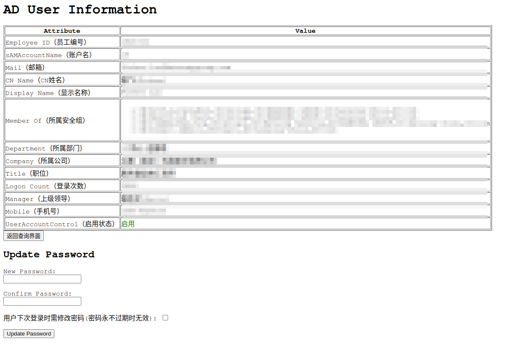

## 声明
- 此项目仅供学习研究，严禁用于生产环境，严禁恶意修改员工ad密码，因此造成的后果作者不负任何责任！请谨慎操作！
- 此项目仅供学习研究，严禁用于生产环境，严禁恶意修改员工ad密码，因此造成的后果作者不负任何责任！请谨慎操作！
- 此项目仅供学习研究，严禁用于生产环境，严禁恶意修改员工ad密码，因此造成的后果作者不负任何责任！请谨慎操作！

## 效果图
- 查询界面


- 账户启用的状态:显示修改密码控件，支持修改ad密码



- 账户禁用的状态:不显示修改密码控件，不支持修改ad密码


## 特性
- 通过web的形式，使用员工工号查询ad信息，让运维不限于使用电脑登录ad服务器的方式查询和修改员工信息
- 员工启用/禁用状态通过颜色区分
- 支持禁用员工的信息查询

## 显示字段包含
- employeeID: 工号
- sAMAccountName: 账号
- mail: 邮箱
- cn: cn姓名(需要base64 -d解码)
- displayName: 显示名称
- memberOf： 安全组路径(多行)
- department: 所属部门(需要base64 -d解码)
- company: 所属公司(需要base64 -d解码)
- title: 职位(需要base64 -d解码)
- logonCount: 登录次数
- manager: 上级领导(取逗号分隔第一个)
- mobile: 手机号
- userAccountControl: 启用状态：512/66080/66048为启用，514/66050为禁用,启用状态绿色显示，禁用状态红色显示

## 密码复杂度：
- 不能包含用户的帐户名，不能包含用户姓名中超过两个连续字符的部分
- 至少有八个字符长度↔
- 不能使用之前设置过的密码←
- 包含以下四类字符中的三类字符:↔
  - 英文大写字母(A到Z)←
  - 英文小写字母(a到z)↔
  - 10个基本数字(0 到 9)←
  - 非字母字符(例如 !、$、#、%)k

## ldapsearch用法
- 通过工号查询员工信息:

```
ldapsearch -H ldap://domain.com -D "cn=administrator,cn=users,dc=domain,dc=com" -w admin_password -b dc=domain,dc=com employeeId=1000001
```

## 用法
- 1.根据实际情况修改python脚本，更新ad服务器和连接用户信息,search_bases尽量精确，避免查询到ad中的计算机信息，导致员工信息不准确

- 2.打包镜像
```
docker build -t ad-operations:latest .
```

- 3.docker部署
```
docker-compose up -d
```

- 4.kubernetes部署
```
kubectl apply -f kubernetes.yaml
```

- 5.访问
  - docker部署：打开浏览器，输入`http://<server_ip>:5000`
  - kubernetes部署：打开浏览器，输入`https://ad-operations.domain.com`

## 说明
- 修改密码功能需要连接ad的用户有修改密码的权限
- 修改密码需要ad连接使用ssl形式，并且使用ldap3模块专用的微软ad模块
- 已禁用账户不支持修改ad密码，修改功能隐藏
- 此项目仅供学习研究，严禁用于生产环境，严禁恶意修改员工ad密码，因此造成的后果作者不负任何责任！请谨慎操作！
